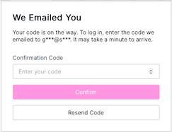

<i class="fa-solid fa-arrow-up"></i>

# Create an Account
{: .no_toc }

1

To create an account, go to <a href="https://app.qr-contest.com" target="_blank">https://app.qr-contest.com</a> and select Create Account in the top tab.

   

   
   

2

Enter a Usename, Password, Email and your Name.  You are required to accept the <a href="https://qr-contest.com/tandc.html" target="_blank">Terms & Conditions</a> to use QR-Contest.

3

To verify your account, you will receive an email from <strong>no-reply@verficationemail.com</strong> - which is an Amazon service - that contains your verification code, e.g.:

   

   
   

4

Enter you verification code on the next screen that will appear after you click Create Account and press Confirm

   

   
   

5

Your account is now created.  To manage your account, go to the Home tab and choose the <i class="fa-solid fa-bars"></i> menu in the upper right, then <a href="../screens/edit_profile">Edit Profile</a>.

