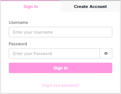

<i class="fa-solid fa-arrow-up"></i>

# Sign In
{: .no_toc }

1

To Sign In, fill out your username and password.  If you forgot your password, click the <i>Forgot your password?</i> link to reset it.

   

   
   

# Forgot Password
{: .no_toc }

1

To reset your password, enter your username and press Send Code, you will receive a code via email from <strong>no-reply@verificationemail.com</strong>

   

   
   

2

Enter your code from the email and enter a new password.

   

   
   
