{: .no_toc}

<i class="fa-solid fa-arrow-up"></i>

  

    Quick Links
  

  {: .text-delta }
- Quick Links
{: toc}

Questions and Answers

## Questions and Answers
  Selecting this section will display the list of Questions that you have created.  When you go to the Contest Detail screen, the first accordion (section) to open up is this one.  To add a new Question, you click on the plus sign <i class="fa-solid fa-square-plus"></i> Add Question.  An empty text box will appear where you enter the Question. You may add multiple Questions per contest *prior* to paying for and launching your contest. See the NOTE below.

   

### First Contest
  If this is your first Contest, you will see the plus sign <i class="fa-solid fa-square-plus"></i> Add Question item.  Click it to add your first question.

  

{: .note}
> If you return to this screen and the plus sign <i class="fa-solid fa-square-plus"></i> Add Question does not appear, it is because you have already purchased this Contest and Question.  If this is the case, a small help icon will appear to the right of the paid for question reminding you that you cannot add or change this quesiton.  You may not add new Questions to an already launched contest.  However, it is possible to add new Answers to an already paid for Question.  After purchase, you may disable an Answer by clicking on the lock icon and choosing Yes to disable it.  You may re-enable it by clicking on the subsequent cirlce with the line through it.  To add an Answer, click the question and you will see the paid for answers with a lock next to them, but the plus sign <i class="fa-solid fa-square-plus"></i> Add Answer will be available.  You may add the new Answers and then go to the Pay and Launch accordion to pay for them. To add a new Question, create a new contest and add the question there.

### Previous Contest Exists - Copy
   If you created a previous contest, when you first go to a new contest, you will see the below interface - which allows you to do three things: 1) Add a new Question; 2) Copy Questions and Answers from a prior Contest; 3) Paste Questions and Answers from a spreadsheet that has a specific format.

   

#### Copy Question(s) from other Contest
   If you have prior Contests, and you are creating a brand new Contest, the first (and only first) time you go to add Questions to your new Contest, you will see a drop down with a list of your prior Contests.  You may copy those Questions (and Answers if you choose the Inlude Answers checkbox) into this Contest by selecting the Contest and choosing Copy.  You will see the Questions copied over to this Contest as new Questions.

   

#### 'Smart Paste' Questions and Answers from Excel
  Sometimes, it is easier to enter your Questions and Answers into a spreadsheet (maybe you already have some there) and then copying those and pasting them into the app.  If you don't use column headers, you need to set up your spreadsheet exactly like the example below.  Here is a template you may use to put the information into the correct columns with headers. <a href="../../../assets/images/sample_upload.xlsx" _target="blank">sample_upload.xlsx</a>
  

   

  
  
The format is a Question in column A on a single line and the Answers in column B on subsequent lines.  You can copy/paste multiple questions by repeating the above pattern.  Select the 2 columns from Excel and choose copy (CTRL+C or CMD+C). You may paste these into the app in 2 different ways.  Press the Paste button and it will extract the data from the clipboard. Or, you can choose Add Question and when the text entry box is flashing like below, press the keyboard combination of (CTRL+V or CMD+V).  That will paste your Questions and Answers into the app.

   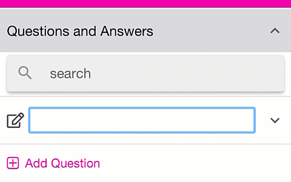

  If you use column headers, you can copy/paste more information in varying formats.  Questions have 3 fields: text, tags and description.  Answers have 7 fields: text, tags, description, imageUrl, linkAction, linkDescription.  The explanation of these fields is below. You don't have to use all of the fields, but be sure to have a field named "text".  If you are only going to paste Questions with no Answers, you can use a spreadsheet with column headers of "text", "tags", "description" - like the below.  Copy the information from the spreadsheet, including the headers, then open a Question text edit box and paste the information.  The app will figure out where to put everything for you. The below will create 2 questions. Here is a sample spreadsheet:

   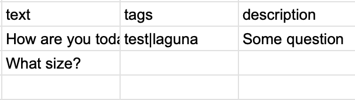

  Note that tags are pipe \| delimited (the vertical bar).  If you would like to just paste Answers, you may use any of the fields above (be sure to include a column named "text").  Copy the area of the spreadsheet and open a text edit area for a new <i>Answer</i>; then paste the values.  The below will create 5 answers. Here is a sample spreadsheet:

   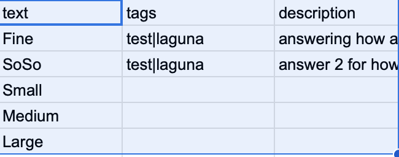

  Perhaps the easiest way to paste both Questions and Answers is to use a more clearly formatted header row.  Just put 'question.' in front of the Question fields or 'answer.' in front of the Answer fields.  For example, you could have  'question.text', 'answers.text' as the 2 columns, when you paste them, you will get Questions with the associated Answers when you paste the values into a question edit text box.  Leave blank values in the 'question.text' column where you have 'answers.text' values.  The below will create 2 questions.  The first question - "How are you today?" - will have 2 answers ("Fine" and "SoSo"); the second question - "What size?" - will have 3 answers ("Small", "Medium", "Large"). Here is a sample spreadsheet (right click it an open it in a new tab to be able to read it better):

   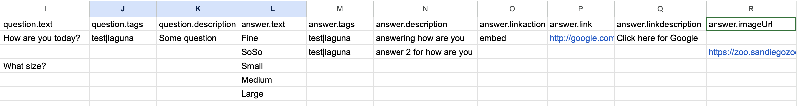

The header fields listed above are:  "question.text", "question.tags", "question.description", "answer.text", "answer.tags", "answer.description", "answer.linkaction", "answer.link", "answer.linkdescription", "answer.imageurl".

#### Question Fields

**text** - This is the text that will display as the question.  Be sure to include the question mark if it is a question.  For example:  "How was your service today?"

**tags** - These are used to help organize things.  To apply multiple tags, separate them with a vertical bar \| character.

**description** - This can be used for you to keep any notes

#### Answer Fields

**text** - The text to display for the Answers.  If you leave this blank, then you **must** supply an imageUrl field.  Note that you can have **text** or **imageUrl** or both for your answer.  If you only supply an **imageUrl** then your answer will be displayed as the image.  If you supply only a **text** value, then your answer will only dispay the text.  If you supply both, your answer will display both the **text** and **imageUrl**

**tags** - These are used to help organize things.  To apply multiple tags, separate them with a vertical bar \| character.

**description** - To keep any notes

**linkaction** - This has to be either 'embed' or 'redirect'.  Any other value will be ignored and dropped.  **embed** means to embed a hyperlink into the Answer results page.  So, after the user scans a QR code, they are presented a results page and on that page the embedded **link** will show up with the text of the link showing the **linkDesription** field below.  The hyperlink itself will be the **link** field as described below.  If you select **redirect**, then the linkDescription field is ignored and the user will not be taken to a results page, but will be automatically redirected to the **link** hyperlink.  The answer will be recorded, but the user will not see the aggregated results.

**link** - See linkaction above.  This is either the hyperlink embedded on the results page or the link that the user us automatically redirected to if **linkaction** is **redirect**.  For example, you could put a link on the results page that goes to your website, or you can use redirect to automatically redirect the user to a survey or other location.

**linkdescription** - This is the text of the hyperlinnk if **linkaction** is set to **embed**.  It is isgnored when **redirect** is chosen for **linkaction**.

**imageurl** - This is a URL of an image that can be displayed as or along with your answer's **text** field.  You may use URLs that start with http:// or https://.  In addition, you may use a URL that starts with file:// and has a local file name.  When you paste this information, the system will then promt you to Browse or Drag and Drop the referenced images into the interface.  For example, if you have a URL of "file:///Users/gregca/images/Bathroom_2.png", after adding the answers, the system will prompt you to upload "Bathroom_2.png".  If you do not upload all matching file:// file names, the unmatched images will have an empty imageUrl.  You may Edit the answer (or location) to upload individual images.  See **text** above.

#### Location Fields
**name** - The text to display for the Location name.

**tags** - These are used to help organize things.  To apply multiple tags, separate them with a vertical bar \| character.

**description** - To keep any notes

**latitude** - (Optional) Used to assist in reporting.  e.g. Laguna Beach: 33.541679

**longitude** - (Optiional) Used to assist in reporting. e.g. Laguna Beach: -117.777214

**imageUrl** - (Optional) This is a URL of an image that can be displayed along with your Location. You may use URLs that start with http:// or https://.  In addition, you may use a URL that starts with file:// and has a local file name.  When you paste this information, the system will then promt you to Browse or Drag and Drop the referenced images into the interface.  For example, if you have a URL of "file:///Users/gregca/images/Bathroom_2.png", after adding the answers, the system will prompt you to upload "Bathroom_2.png" (it will ignore the path).  If you do not upload all matching file:// file names, the unmatched images will have an empty imageUrl.  You may Edit the Location to upload individual images.

### Questions
When you click the plus sign <i class="fa-solid fa-square-plus"></i> Add Question, a text box should appear for you to start typing into.  

   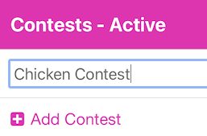

If it does not, you may also edit the Question text by pressing the Edit <i class="fa-solid fa-pen-to-square"></i> icon to the left of the text.  You will get the Edit Question form shown below.  Alternatively, long pressing the empty text area will also edit inline without the form.

   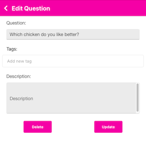

If you do not want to edit anything, you may press the back chevron <i class="fa-solid fa-chevron-left"></i> in the upper left.  You may delete this question by presing the Delete button.  If you make any changes, be sure to press the Update button.

You may add Tags that may be used in any Contest.  You add a tag by typing the tag value, in the case below, 'chicken' was typed.  That will add the tag to your global tags.  If you have other tags, they will auto-complete as you start to type them. So, if you add 'chicken' here and later in an Answer you type 'ch' - it should auto-complete to 'chicken'.   The tags are to assist you in organizing your information.  They will show up in the user interface on a later update to the application.

   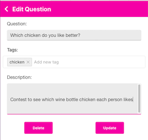

### Answers
To add answers, you need to click on the Question (you'll see a up/down chevron on the right of the question).

When you click the plus sign <i class="fa-solid fa-square-plus"></i> Add Answer, a text box should appear for you to start typing into (just like Questions).  Below you'll see we added 3 Answers.

   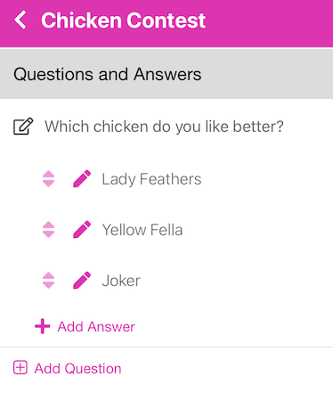

{: .new }
> Any time you have text in a list, you may long-press on it to edit the text inline.  This saves you steps from pressing the pencil and editing the text in a form.

#### Reorder Answers
The up/down arrows icon on the left of each Answer allows you to reorder the Answers.  Long press on the up/down arrows and then drag the Answer to the position you would like.  The Answers will show up in your PDF or PNG files in the order you have them here.

#### Edit Answer
You may edit the Answer details by pressing the pencil <i class="fa-solid fa-pen"></i> icon to the left of the text.  You will get the Edit Answer form shown below.

   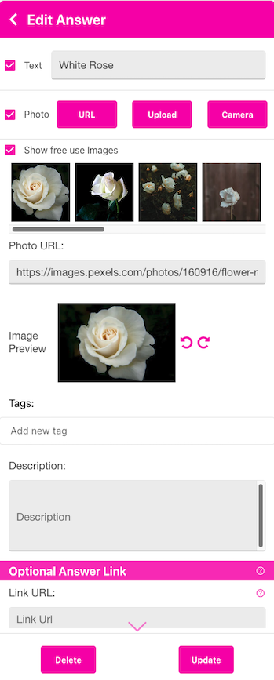

Answers may be either Text, Photo or both.  The default type is a Text answer.  You would enter the Answer in the Text Answer box.  If you would like to add a Photo to your Answer, you may choose a free suggestion image by checking the <i class="fa-regular fa-square-check"></i> Show free use Images checkbox.  When you type Text and tab out of the Text box, the suggestion images will appear.   You may click on one to choose it.  A nice trick for having only an image as an answer is to type into the Text box to find the image, click on it, then uncheck the Text box.  To upload or use a local image, check the <i class="fa-regular fa-square-check"></i>Photo checkbox and then choose either Enter URL, Upload or Take Photo.  After completing your choice, the image will show up in the Image Preview area.  You may rotate your image by using the left <i class="fa-solid fa-rotate-left"></i> and right <i class="fa-solid fa-rotate-right"></i> rotate icons.  After you press the Update button, you will not be able to rotate the image, you will have to re-enter it to rotate it.

You may add Tags that may be used in any Contest.  You add a tag by typing the tag value.  That will add the tag to your global tags.  If you have other tags, they will auto-complete as you start to type them.

The Description area is for your own use.

#### Optional Answer Link

Optional Answer Link

This option is very powerful.  You specify a link that will either show up on the Results page (after the user scans a QR code answer), or will automatically redirect the user to the Link.

<i class="fa-regular fa-circle"></i> Link - Selecting this option will show a Link on the Results page.  The Text of the link (the highlighted text the user may click on) can be entered in the Link Text box.  

For example, if you would like to collect some demographic information, or have someone sign up for your newsletter after then scan the Answer, put "SignUp for Newsletter" as the Link Text and enter the URL for your SignUp form in the Link URL.  

Below we show a sample where a voter scanned the QR code for the Model S and the Link Text was "Model S" and the Link URL was https://www.tesla.com/sites/default/files/tesla-model-s.pdf

Results after scanning

   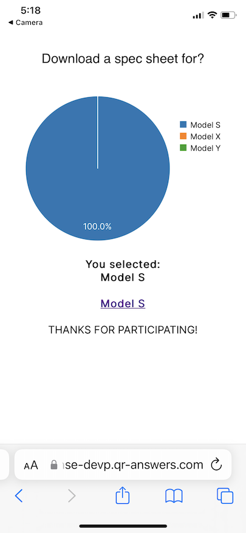

{: .note}
> You may change the displayed graphic by changing it under [Configure Options](./config_opts#qr-scan-response-chart-style)

<i class="fa-regular fa-circle"></i> Automatic Redirect - instead of showing the Results page, the user will be automatically redirected to the Link URL.  The Link Text is not used.  So, when the voter selects the QR code answer, the vote will be recorded and they will be redirected to the URL you put in the Link URL. Clicking on the underlined Model S will take the voter to the Model S PDF file.

This can be used in many ways; for example, let's say you wanted to distribute some documents.  Perhaps your "Question" would be:  **Download a spec sheet for?**   Then the answers would say *"Model S"*, *"Model X"*, *"Model Y"*.  Then, for each answer, you would select Automatic Redirect and have the Link URL go to https://www.tesla.com/sites/default/files/tesla-model-s.pdf for the Model S, etc.

   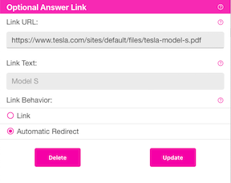

PDF

  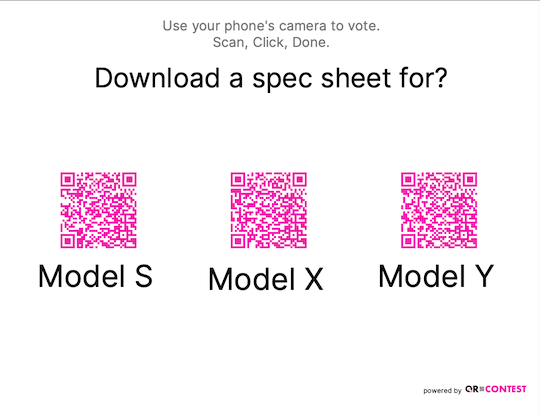

Results after scanning

   

