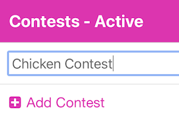
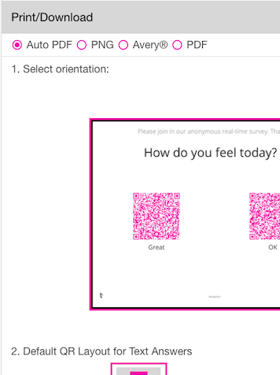

<i class="fa-solid fa-arrow-up"></i>

# First Contest
{: .no_toc }
This section will show you how to create your first Contest with a single Question and 3 Answers.
For QR-Contest, go to <a href="https://app.qr-contest.com" target="_blank">https://app.qr-contest.com</a> and log in.  If you have not created an account, go to [Creating an Account](../account) to learn how to sign up.

---

1

Choose Contests in the bottom nav bar

   

   
   

2

Press the plus sign <i class="fa-solid fa-square-plus"></i> Add Contest

   

     
   

3

Enter the Contest name and press &lt;Enter&gt;

   

     
   

4

Click on the Contest name to add Question(s) and Answers here:

   

     
   

5

Click Add Question, enter the question, e.g. <i>Which chicken do you like better?</i>

   

   
   

{: .new }
> Any time you have text in a list, you may long-press on it to edit the text inline.  This saves you steps from pressing the pencil and editing the text in a form.

6

Click Add Answer.  Enter some text answers (we'll add images later).

   

   
   

7

Scroll down and click the Print/Download section accordion.

   

   
   

8

You can make a PDF with automatic layout, or individual PNG files, or Avery© labels, or manually layout a PDF. Just scroll down skipping the options and click Make PDF

   

   
   

9

Your PDF will be generated showing your Question and Answers.

   

   
   

10

After it downloads, you can click on the name to print it or display it on your screen.  You can also click the copy icon <i class="fa-regular fa-clone"></i> to copy the URL and paste it into another browser window/tab.

   

   
   

11

Now you can test your Contest Question by using your phone's camera and scan one of the QR code answers.  When the link appears, click it.  Done!  You're answer will be recorded and you will see the results.

To see how to add photos to the answers, check out the next section: [Photo Answers](imageanswers)