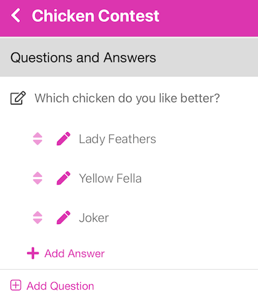

<i class="fa-solid fa-arrow-up"></i>

# Photo Answers
{: .no_toc }

---

Answers may have Text answers, Photo answers or a combination of both.  This will show you how to add Photos to your answers.

After completing the steps in [First Contest](firstcontest), you may add photos to your answers so the answers
have more visual appeal.

1

Go to your Contest under the Contest bottom tab.

   

   
   

2

Click on the Contest created in <a href="/docs/quickstart/firstcontest">First Contest</a>. For this example, we used <i>Which chicken do you like better?</i>

   

   
   

3

  

  For each answer shown there are 3 icons on the line. The up/down arrow <i class="fa-solid fa-up-down"></i> allows you to drag the order of the answers so they display in that order (long press on them to drag them).  The pencil icon <i class="fa-solid fa-pencil"></i> allows you to edit the details of the answer (there are many options).  The trash can icon (not shown) on the far right <i class="fa-solid fa-trash"></i> allows you to delete that answer (it will ask you to confirm prior to actually deleting it.)
  

 

4

Let's add photos to each chicken.  Click the pencil icon next to <i>Lady Feathers</i>. For details of all the options, see the <a href="../screens/edit_answer">Edit Answers</a> page. For now, we'll just add a photo.

   Click the <i class="fa-regular fa-square-check"></i> Photo checkbox. This will add an Image Preview section.  You may enter a URL, Upload an photo, or if you are on your phone - Take a Photo.  You may also use any of the suggestion images if you have the <i class="fa-regular fa-square-check"></i> Show free use Images checkbox checked.  We'll upload a photo.

   

   
   

   {: .note }
   > After the photo is uploaded, you may rotate it by using the rotation buttons.  You will only be able to rotate it when you upload it, not after you save it by pressing Update.

   Scroll down and select the Update button to save your Photo.

5

Repeat the process for each Answer. You will end up with something like this:

   

   
   

6

Scroll down to the Print/Download accordion and click on it, then scroll down to the Make PDF button (notice the section *4. Fit and Opacity for Photo Answers*, it is set to 'Cover').  Click the Make PDF button, then download and view your PDF.

  

7

Click on Print/Download again to close then open it.  Scroll down to section *4. Fit and Opacity for Photo Answers* and choose <i class="fa-regular fa-circle-dot"></i> Contain.  Then click Make PDF

  

This shows how you can modify how your images are displayed.  If you want the entire image to be displayed, choose Contain.  If you want the image to be centered in the output area, and fill the area, choose Cover.