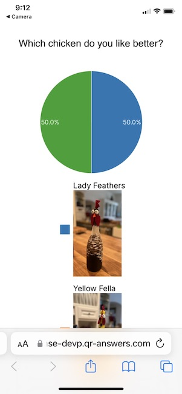

<i class="fa-solid fa-arrow-up"></i>

# QR-Contest.com and QR-Answers.com
{: .no_toc }

QR-Answers and QR-Contest are survey-like applications that allow you to publish a question where the answers are marked with QR codes.  Most QR code survey apps take you to a web page where you have to fill out a lengthy survey or set of forms.  Those survey types lose 90% of thier participants in the first few questions.

QR-Answers and QR-Contest are different because the **answer** *is* the QR code.  The voter only has to scan the code on their phone and click the displayed link. Done!  That action alone registers the answer that they have chosen - no surveys, no extra stuff to fill out.

 **QR-Answers** is for enterprise customers wishing to survey multiple projects and locations and is fully multi-user and collaborative.  **QR-Contest** is more consumer focused to allow you to have a fun way for people to vote for their favorite chilli in a cookoff, artwork on a wall, whether they were naughty or nice, etc.

## Quick Start
Here is a video with a brief walkthrough. 

<video width="268" height="640" controls>
  <source src="./assets/images/quickstart.mp4">
</video>

Here is a simple question (you can follow the [Quick Start](docs/quickstart) to see the full question) with a set of 3 answers.  You can see the first answer is scanned and shows a highlighted link <i class="fa-solid fa-link"></i>qr-answers.com >.

When you select the link, it will take you to a page that shows your response (Lady Feathers) and all the recorded responses in graphical format (there are lots of choices for this page).  Done!

To get started go to the [Quick Start](docs/quickstart)

As the creator of the contest, you are able to log into https://app.qr-contest.com and view the results for the most recent Contests on the home page or see all the results under the [Results](docs/results) bottom tab.
